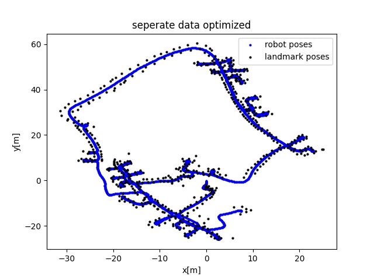

# Graph-based optimization SLAM

graph-based SLAM optimization to determine robot positions and feature locations.

The aim is to provide code for easy understanding of the graph-based optimization using 'standard' python packages. 

Python 3

pip install -r requirements.txt

run 'main.py'

